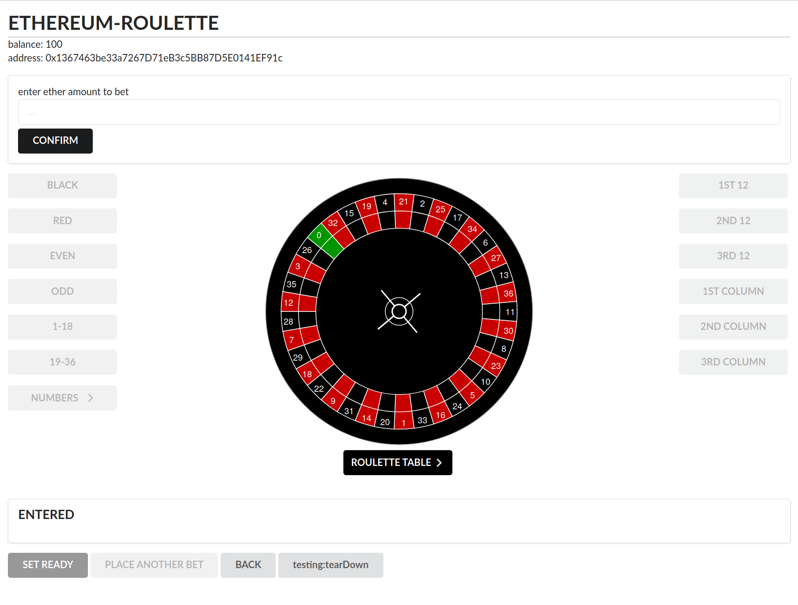

### Setup

* Install node (version 10) and npm
* Download [Ganache](https://www.trufflesuite.com/ganache)
* Install dependencies:
```
npm install
```

### Run
* Start Ganache and click `Quickstart`
* Run Ethereum Bridge:
```shell script
ethereum-bridge -H localhost:7545 --broadcast -a 0 --dev
```
when it prompts: Y, then 0, then Y
* Compile contracts (navigate to the `src/truffle` directory):
```shell script
truffle compile
```
* Deploy contracts: 
```shell script
truffle migrate
```
* Start web application (navigate back to root directory):
```
npm start
```
* Open browser and type: 
`localhost:3000`
