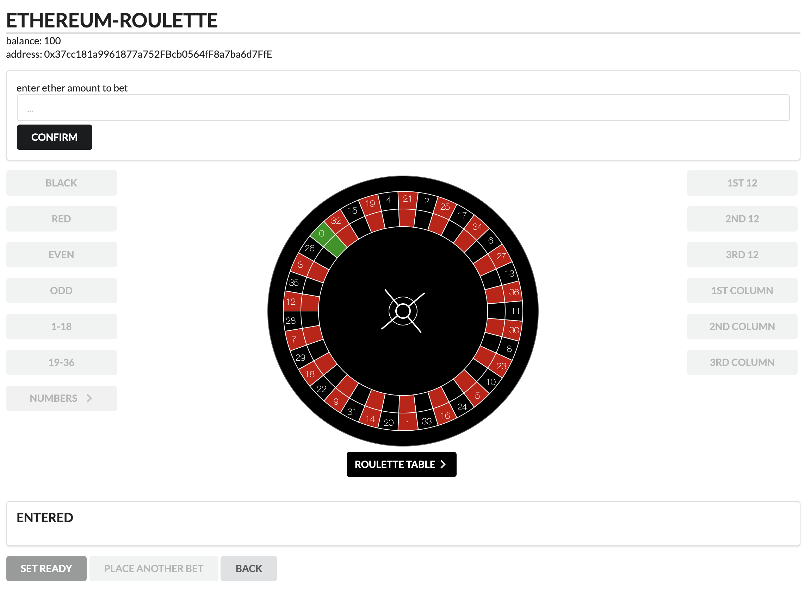

## Ethereum Roulette
This dApp is our submission for the BCOLN Challenge Task at the University of Zurich.



#
### Setup

* Install node (version 10) and npm
* Download [Ganache](https://www.trufflesuite.com/ganache)
* Install the Browser Extension [MetaMask](https://metamask.io)
* Install dependencies:
```
npm install
```
#
### Run
* Start Ganache and click `Quickstart`
* Run Ethereum Bridge:
```shell script
ethereum-bridge -H localhost:7545 --broadcast -a 0 --dev
```
when it prompts: Y, then 0, then Y
* Compile contracts (navigate to the `src/truffle` directory):
```shell script
truffle compile
```
* Deploy contracts: 
```shell script
truffle migrate
```
* Start web application (navigate back to root directory):
```
npm start
```
* Open browser and type: 
`localhost:3000`
* Use the Ganache Mnemonic to set up the accounts with MetaMask
    * Please Note that you may have to [reset your MetaMask accounts](https://metamask.zendesk.com/hc/en-us/articles/360015488891-Resetting-an-Account) if you have set up a new instance of Ganache!
#
### Dependencies
our application relies on the following dependencies:
* [Ethereum Bridge](https://github.com/provable-things/ethereum-bridge)
* [Truffle](https://www.trufflesuite.com/truffle)
* [React-Raphael](https://github.com/liuhong1happy/react-raphael)
* [Web3](https://github.com/ethereum/web3.js/)
* [Semantic-ui-react](https://react.semantic-ui.com)

our roulette wheel is an adaptation of the [implementation by Jeff Conrad](https://github.com/ledlogic/roulette)
